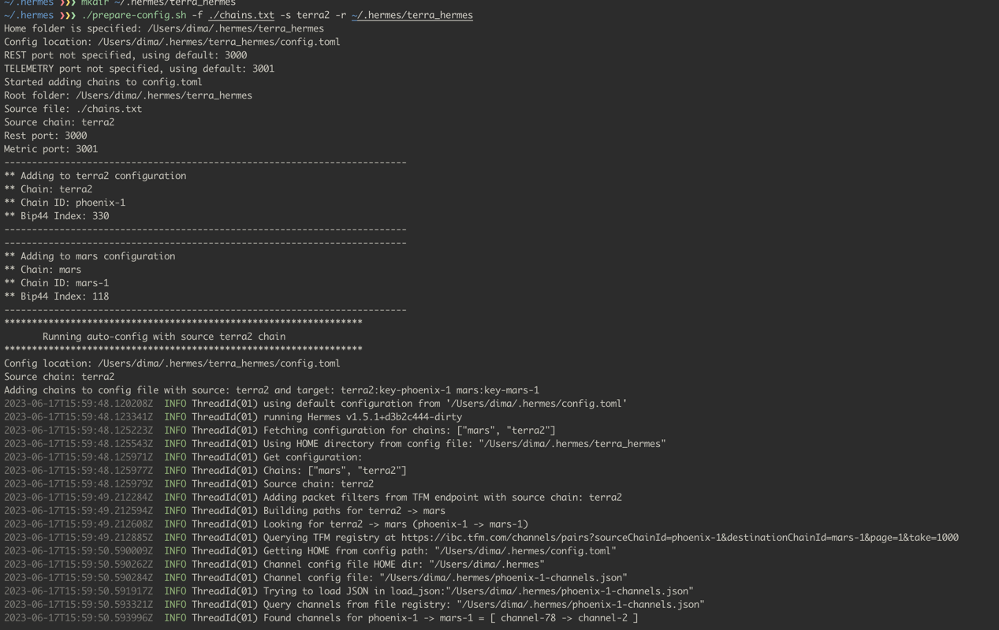
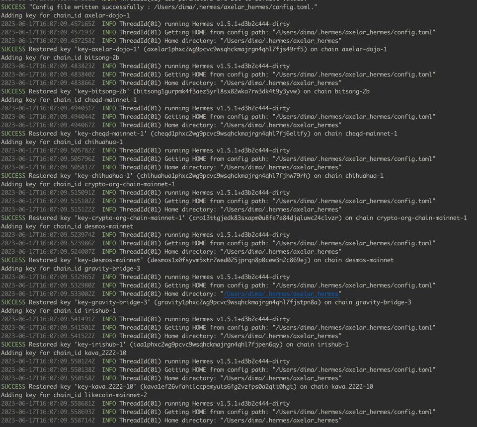

# Hermes configuration

## Table of Contents

1. [Goal](#goal)
2. [Purpose of script](#purpose)
3. [Prerequisites](#prerequisites)
4. [How to run Hermes](#hermes)
5. [Prepare configuration](#prepare)
5. [Troubleshooting](#troubleshooting)

## The goal <a name="goal"/>

The purpose of this folder is to provide a set of scripts and configuration files to run and configure Hermes instances.

- Configuration of Hermes instances
- Start/Stop Hermes instances
- Create channels
- Configure chain - chain id mapping
- Show information about
  - created channels
  - running instances
  - chain configuration
  - chain id mapping

## <a name="purpose">Purpose of scripts</a>

- `create-channel.sh` - create channels from a single source to destination chains using chain list
- `creat-many-to-many` - create channels from a multiple source to destination chains using chain list for src and dest
- `create_channels.rb` - create channels for a new chains which appeared since the latest channels update
- `daemon_create_channels.rb` - uses create_channels.rb and created daemon
- `daemon_proxy_config.rb` - starts/stops daemon to update proxy settings
- `daemon_start_hermes.rb` - periodically restarts hermes instances
- `daemon_update_chain_registry.rb` - start a daemon to update the local dictionary chain name - chain id
- `expired_terra_channels.rb` - show expired `terra2` channels
- `hermes_configure_many.sh` - configure hermes instances per each chains pair using src and dest list from files
- `hermes_many.rb` - multi-purpose script described below to configure, start/stop and other operations
- `install_deps.sh` - install dependencies on the fresh install
- `prepare-config.sh` - configure hermes instances from a source chains to destination chains with packet filtering
- `prepare-config-single.sh` - configure single hermes instance from a source chain to destination chain
- `show_registered.sh` - how to display existing channels with terra2 as source and other chains
- `update_chain_registry.rb` - updates a dictionary chain name - chain id in the local folder to file `chain_chainid.json`

## <a name="prerequisites">Prerequisites</a>

- `chain_chainid.json` - the map of chain name to chain id
- `chains.txt` - the list of chains to be used in the configuration
- list of channel registry json files: `X-channel-id.json` where X is the chain id
- `$HOME/.hermes/mnemonics/common.txt` - the file with one mnemonics to generate wallets for each chain

## <a name="hermes">Approaches to run Hermes instances</a>

1. Run single Hermes instance with multiple channels per each chain (single config file)
2. Run multiple Hermes instances with single channel per instance
3. Run everything in one Hermes instance (single config file)

Last approach is less flexible and not recommended.

## <a name="prepare">Prepare configuration</a>

To start Hermes instances, we need to prepare configuration files and decide which approach to use.

### Command and examples

This command will do the following:

1. Add each chain from the list to configuration file.
2. Restore keys for each chain from mnemonic file.
3. Enables all endpoints
4. Updates max gas
5. Updates terra2 configuration

#### Using bash script

```bash
./prepare-config.sh -f <file with list of chains> -s <source chain name, not id> -r <instance home folder>
```

Example:

```bash
./prepare-config.sh -f ./chains.txt -s terra2 -r ~/.hermes/terra_hermes
```

Conditions:

- chains.txt must exist
- source chain must be in the list of chains in chains.txt
- ~/.hermes/terra_hermes must exist



#### Using hermes_many.rb

The difference with bash script is that it will prepare every condition without manual steps, but also
it will create configuration for each chain specified in the channel registry file `X-channel-id.json`

Example:

```bash
./hermes_many.rb init-one axelar
```

It will create configuration for `axelar` chain with all channels created from axelar to other chains.





## <a name="troubleshooting">Troubleshooting</a>

### Gas issues corner cases

- https://github.com/informalsystems/hermes/issues/2487  
- https://hermes.informal.systems/advanced/troubleshooting/cross-comp-config.html

Multiply this amount with the gas estimate, used to compute the fee
and account for potential estimation error.

The purpose of multiplying by `gas_multiplier` is to provide a bit of a buffer
to catch some of the cases when the gas estimation calculation is on the low
end.
 
Example: With this setting set to 1.1, then if the estimated gas
is 80_000, then gas used to compute the fee will be adjusted to
80_000 * 1.1 = 88_000.

Default: 1.1, i.e. the gas is increased by 10%
Minimum value: 1.0
gas_multiplier = 1.1

### Explanation

Transaction is not discarded when created on the node and ended up in the mempool.
So, there are several stage where gas issue may occur.

- DeliverTx
- CheckTx
- ...

This is about how Hermes filters transaction and accepts them and how it manages gas mulpiplier.


### Solution 

gas_multiplier = 1.3 is an enough good solution