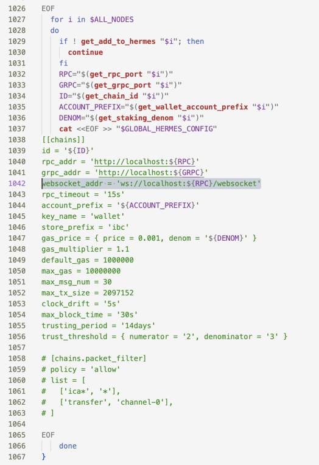
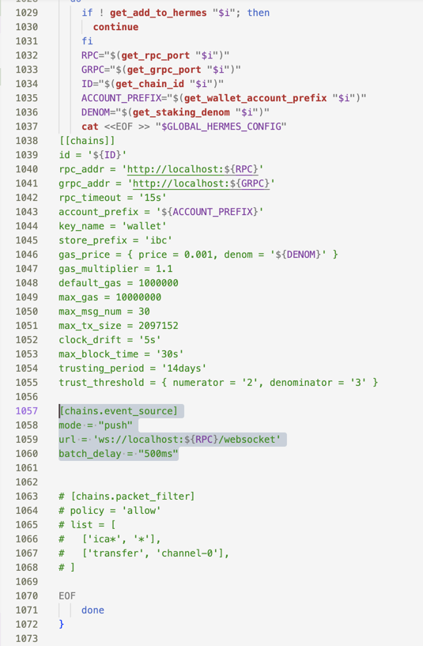

# Instruction for manual steps

All these steps were taken from official documentation and executed on MacOS M1.

Check your GOPATH environment

```
go env GOPATH
```

My local GOPATH is `$HOME/go`

## Hermes setup

### Get hermes master version

```bash
git clone https://github.com/tfm-com/tfm_hermes_relayer.git
```

### Build hermes

```bash
cd tfm_hermes_relayer
make install
```

Check hermes version
```
hermes --version
hermes 1.5.1+50b43f96-dirty
```

## Gaia setup

```bash
git clone https://github.com/cosmos/gaia.git ~/go/src/github.com/cosmos/gaia
cd ~/go/src/github.com/cosmos/gaia
make install
```

Check installation

```
which gaiad
~/go/bin/gaiad
```

## Gaiad manager setup

### Install dependencies

#### Install stoml

```
GO111MODULE=on go install github.com/freshautomations/stoml@latest
```

Check version

```
stoml --version
stoml version 0.7.0
```

#### Install sconfig

```bash
go install github.com/freshautomations/sconfig@latest
```

Check version

```
sconfig --version
sconfig version 0.1.0
```

### Install gaiad manager

```bash
git clone https://github.com/informalsystems/gm
gm/bin/gm install
```

Check on the GM command:

```bash
type gm
```

Should be 
```
gm is an alias for $HOME/.gm/bin/gm
```

Run
```bash
gm install
```

#### Install shell completion (optional)

```
brew install bash-completion
brew install zsh-completion
```

## Configure gm.toml

Replace `$HOME/.gm/gm.toml` with the following content.
Make sure all paths are correct and match your environment.

```toml
[global]
add_to_hermes = false
auto_maintain_config = true
extra_wallets = 2
gaiad_binary="$HOME/go/bin/gaiad"
hdpath = ""
home_dir = "$HOME/.gm"
ports_start_at = 27000
validator_mnemonic = ""
wallet_mnemonic = ""

[global.hermes]
binary="$HOME/.cargo/bin/hermes"
config = "$HOME/.hermes/config.toml"
log_level = "info"
telemetry_enabled = true
telemetry_host = "127.0.0.1"
telemetry_port = 3001

[ibc-0]
ports_start_at = 27010

[ibc-1]
ports_start_at = 27020

[node-0]
add_to_hermes = true
network = "ibc-0"
ports_start_at = 27030

[node-1]
add_to_hermes = true
network = "ibc-1"
ports_start_at = 27040
```

## Configure GM config

GM uses an outdated configuration. 
To fix it to use the latest version, do the following:

### Check on the current version

#### Delete old config

Go to $HOME/.gm/bin/lib-gm and open it using any text editor.  
Find the following line (should be 1042 line)
```
websocket_addr = 'ws://localhost:${RPC}/websocket'
```



And delete it

#### Add a new section config below `[[chains]]` section

```
[chains.event_source]
mode = "push"
url = 'ws://localhost:${RPC}/websocket'
batch_delay = "500ms"
```

The result should look like this:



Now, the configuration is DONE

## Configure test chains

```shell
gm keys
gm start
gm hermes config
gm hermes keys
gm status
```

### Fix gas multiplier

Go to Hermes config at `$HOME/.hermes/config.toml` and change `gas_multiplier` to `1.3` for both chains.

### The result

Hermes config at `$HOME/.hermes/config.toml` should look like this:

```toml
[global]
log_level = 'info'

[mode]

[mode.clients]
enabled = true
refresh = true
misbehaviour = true

[mode.connections]
enabled = true

[mode.channels]
enabled = true

[mode.packets]
enabled = true
clear_interval = 100
clear_on_start = true
tx_confirmation = true

[telemetry]
enabled = true
host = '127.0.0.1'
port = 3001

[[chains]]
id = 'ibc-0'
rpc_addr = 'http://localhost:27030'
grpc_addr = 'http://localhost:27032'
rpc_timeout = '15s'
account_prefix = 'cosmos'
key_name = 'wallet'
store_prefix = 'ibc'
gas_price = { price = 0.001, denom = 'stake' }
gas_multiplier = 1.3
default_gas = 1000000
max_gas = 10000000
max_msg_num = 30
max_tx_size = 2097152
clock_drift = '5s'
max_block_time = '30s'
trusting_period = '14days'
trust_threshold = { numerator = '2', denominator = '3' }

[chains.event_source]
mode = "push"
url = 'ws://localhost:27030/websocket'
batch_delay = "500ms"

# [chains.packet_filter]
# policy = 'allow'
# list = [
#   ['ica*', '*'],
#   ['transfer', 'channel-0'],
# ]

[[chains]]
id = 'ibc-1'
rpc_addr = 'http://localhost:27040'
grpc_addr = 'http://localhost:27042'
rpc_timeout = '15s'
account_prefix = 'cosmos'
key_name = 'wallet'
store_prefix = 'ibc'
gas_price = { price = 0.001, denom = 'stake' }
gas_multiplier = 1.3
default_gas = 1000000
max_gas = 10000000
max_msg_num = 30
max_tx_size = 2097152
clock_drift = '5s'
max_block_time = '30s'
trusting_period = '14days'
trust_threshold = { numerator = '2', denominator = '3' }

[chains.event_source]
mode = "push"
url = 'ws://localhost:27040/websocket'
batch_delay = "500ms"

# [chains.packet_filter]
# policy = 'allow'
# list = [
#   ['ica*', '*'],
#   ['transfer', 'channel-0'],
# ]

```

Check the status of test chains:

```shell
gm status
```

```
NODE               PID    RPC   APP  GRPC  HOME_DIR
ibc-0            85439  27010 27011 27012  $HOME/.gm/ibc-0
 node-0          85630  27030 27031 27032  $HOME/.gm/node-0
ibc-1            85512  27020 27021 27022  $HOME/.gm/ibc-1
 node-1          85746  27040 27041 27042  $HOME/.gm/node-1
```

Now you can run hermes:

```shell
hermes start
```

```
2023-06-22T10:49:29.556644Z  INFO ThreadId(01) using default configuration from '/Users/dima/.hermes/config.toml'
2023-06-22T10:49:29.559201Z  INFO ThreadId(01) running Hermes v1.5.1+50b43f96-dirty
2023-06-22T10:49:29.564771Z  INFO ThreadId(01) rest: REST server disabled
2023-06-22T10:49:29.565605Z  INFO ThreadId(18) telemetry service running, exposing metrics at http://127.0.0.1:3001/metrics
2023-06-22T10:49:29.601790Z  WARN ThreadId(20) health_check{chain=ibc-0}: Chain 'ibc-0' has no minimum gas price value configured for denomination 'stake'. This is usually a sign of misconfiguration, please check your chain and relayer configurations
2023-06-22T10:49:29.610997Z  INFO ThreadId(01) health_check{chain=ibc-0}: chain is healthy
2023-06-22T10:49:29.614186Z  WARN ThreadId(21) health_check{chain=ibc-1}: Chain 'ibc-1' has no minimum gas price value configured for denomination 'stake'. This is usually a sign of misconfiguration, please check your chain and relayer configurations
2023-06-22T10:49:29.617587Z  INFO ThreadId(01) health_check{chain=ibc-1}: chain is healthy
2023-06-22T10:49:29.620509Z  INFO ThreadId(01) scan.chain{chain=ibc-0}: scanning chain...
2023-06-22T10:49:29.620543Z  INFO ThreadId(01) scan.chain{chain=ibc-0}: scanning chain for all clients, connections and channels
2023-06-22T10:49:29.620695Z  INFO ThreadId(01) scan.chain{chain=ibc-0}: scanning all clients...
2023-06-22T10:49:29.623828Z  INFO ThreadId(01) scan.chain{chain=ibc-1}: scanning chain...
2023-06-22T10:49:29.623849Z  INFO ThreadId(01) scan.chain{chain=ibc-1}: scanning chain for all clients, connections and channels
2023-06-22T10:49:29.623852Z  INFO ThreadId(01) scan.chain{chain=ibc-1}: scanning all clients...
2023-06-22T10:49:29.625262Z  INFO ThreadId(01) scanned chains:
2023-06-22T10:49:29.625268Z  INFO ThreadId(01) # Chain: ibc-0
# Chain: ibc-1

2023-06-22T10:49:29.625740Z  INFO ThreadId(01) spawn:chain{chain=ibc-0}: spawning Wallet worker: wallet::ibc-0
2023-06-22T10:49:29.625969Z  INFO ThreadId(01) spawn:chain{chain=ibc-1}: spawning Wallet worker: wallet::ibc-1
2023-06-22T10:49:29.637849Z  INFO ThreadId(01) Hermes has started

```


DONE